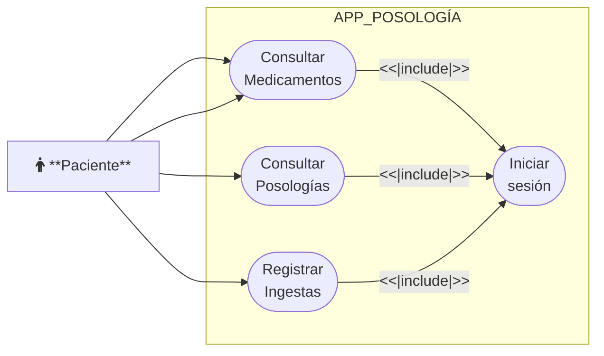
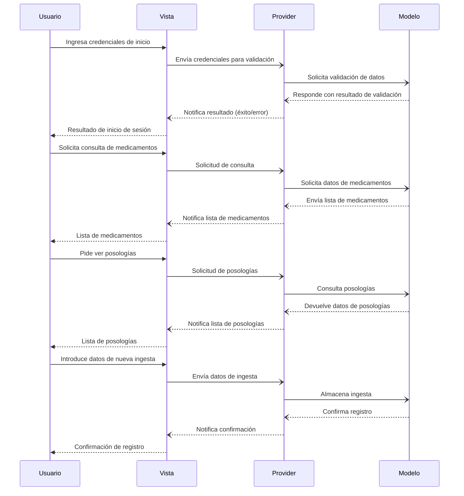
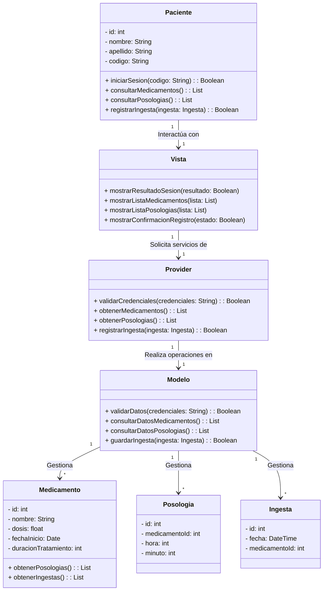

# Diseño software

### Digrama de casos de uso

```mermaid

flowchart LR

    %% Definir el subgrafo de la aplicación de posología
    subgraph APP_POSOLOGÍA 
        %% Definir nodos con bordes redondeados
        I(["Iniciar<br> sesión"])
        
        B(["Consultar <br> Medicamentos"])
        B--<<|include|>>--> I
        
        C(["Consultar <br> Posologías"])
        C--<<|include|>>--> I

	E(["Registrar <br> Ingestas"])
        E--<<|include|>>--> I

    end

    %% Conectar el nodo del paciente con principal
    A["fa:fa-person" **Paciente**] --> B
    A --> B
    A --> C
    A --> E

```

### Digrama de secuencia 

```mermaid
sequenceDiagram
    participant Usuario
    participant Vista
    participant Provider
    participant Modelo

    Usuario ->> Vista: Ingresa credenciales de inicio
    Vista -) Provider: Envía credenciales para validación
    Provider -) Modelo: Solicita validación de datos
    Modelo --) Provider: Responde con resultado de validación
    Provider --) Vista: Notifica resultado (éxito/error)
    Vista -->> Usuario: Resultado de inicio de sesión

    Usuario ->> Vista: Solicita consulta de medicamentos
    Vista -) Provider: Solicitud de consulta
    Provider -) Modelo: Solicita datos de medicamentos
    Modelo --) Provider: Envía lista de medicamentos
    Provider --) Vista: Notifica lista de medicamentos
    Vista -->> Usuario: Lista de medicamentos

    Usuario ->> Vista: Pide ver posologías
    Vista -) Provider: Solicitud de posologías
    Provider -) Modelo: Consulta posologías
    Modelo --) Provider: Devuelve datos de posologías
    Provider --) Vista: Notifica lista de posologías
    Vista -->> Usuario: Lista de posologías

    Usuario ->> Vista: Introduce datos de nueva ingesta
    Vista -) Provider: Envía datos de ingesta
    Provider -) Modelo: Almacena ingesta
    Modelo --) Provider: Confirma registro
    Provider --) Vista: Notifica confirmación
    Vista -->> Usuario: Confirmación de registro
```

### Digrama de Clases

```mermaid

classDiagram
    class Paciente {
        - id: int
        - nombre: String
        - apellido: String
        - codigo: String
        + iniciarSesion(codigo: String): Boolean
        + consultarMedicamentos(): List<Medicamento>
        + consultarPosologias(): List<Posologia>
        + registrarIngesta(ingesta: Ingesta): Boolean
    }

    class Medicamento {
        - id: int
        - nombre: String
        - dosis: float
        - fechaInicio: Date
        - duracionTratamiento: int
        + obtenerPosologias(): List<Posologia>
        + obtenerIngestas(): List<Ingesta>
    }

    class Posologia {
        - id: int
        - medicamentoId: int
        - hora: int
        - minuto: int
    }

    class Ingesta {
        - id: int
        - fecha: DateTime
        - medicamentoId: int
    }

    class Vista {
        + mostrarResultadoSesion(resultado: Boolean)
        + mostrarListaMedicamentos(lista: List<Medicamento>)
        + mostrarListaPosologias(lista: List<Posologia>)
        + mostrarConfirmacionRegistro(estado: Boolean)
    }

    class Provider {
        + validarCredenciales(credenciales: String): Boolean
        + obtenerMedicamentos(): List<Medicamento>
        + obtenerPosologias(): List<Posologia>
        + registrarIngesta(ingesta: Ingesta): Boolean
    }

    class Modelo {
        + validarDatos(credenciales: String): Boolean
        + consultarDatosMedicamentos(): List<Medicamento>
        + consultarDatosPosologias(): List<Posologia>
        + guardarIngesta(ingesta: Ingesta): Boolean
    }
	
    Paciente "1" --> "1" Vista : Interactúa con
    Vista "1" --> "1" Provider : Solicita servicios de
    Provider "1" --> "1" Modelo : Realiza operaciones en
    Modelo "1" --> "*" Medicamento : Gestiona
    Modelo "1" --> "*" Posologia : Gestiona
    Modelo "1" --> "*" Ingesta : Gestiona

```

### Diagrama de flujo

